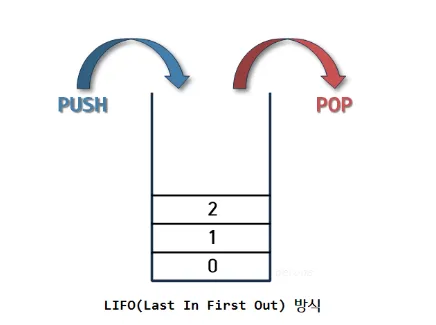

### 스택의 의미

| 쌓아 올린다는 것을 의미

- 같은 구조와 크기의 자료를 정해진 방향으로만 쌓을 수 있다.
- top으로 정한 곳을 통해서만 접근 가능
- 자료를 삭제할 때도 top을 통해서만 가능
- top을 통해 삽입하는 연산 **PUSH**
- top을 통해 삭제하는 연산 **POP**
- 시간 순서에 따라 자료가 쌓여서 가장 마지막에 삽입된 자료가 가장 먼저 삭제

비어있는 스택에서 원소 추출 → stack underflow

스택이 넘치는 경우 → stack overflow

### 활용 예시

- 웹 브라우저 뒤로가기
- 역순 문자열 만들기
- 실행 취소
- 후위 표기법 계산
- 수식의 괄호 검사 : 연산자 우선순위 표현을 위한 괄호 검사
